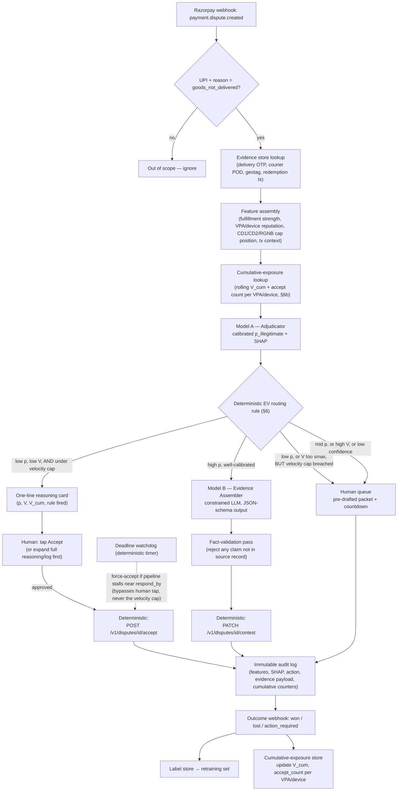

# Aegis — UPI P2M Dispute-Defense Engine
### Final Architecture — Razorpay AI Buildathon, Track 02 (AI Risk Manager)

> This document is written to be dropped into the repo as `ARCHITECTURE.md` directly. It is deliberately scoped to **one class of loss**, per the track's own bar, and built deep rather than wide.

---

## 0. Judging-criteria map (read this first)

Track 02's official bar, paraphrased from the buildathon page: build a detector/verifier/auto-responder for **one class of loss**, with measured precision and recall on a held-out set, honest metrics including false-positive cost, strictly defense-only — anything offense-capable is disqualified. Four things get scored: Problem Taste, Build Quality, AI Judgment, Failure Recovery.

| Criterion | Where this build satisfies it |
|---|---|
| **Problem Taste** | One precisely-defined loss class (§1), grounded in real NPCI mechanics (UDIR, RGNB) most builders won't have researched — not a generic "detect fraud" pitch |
| **Build Quality** | Small deterministic core + one ML model + one constrained LLM call, cleanly separated in the repo tree (§8), no framework theater |
| **AI Judgment** | Explicit, justified boundary between deterministic rules, ML scoring, and LLM drafting (§3) — this is the single highest-leverage section in this doc |
| **Failure Recovery** | `FAILURE_LOG.md` (§8) is a real, dated record of wrong assumptions caught and corrected against primary/secondary sources — not a story invented after the fact |
| **"One class of loss, precision/recall on held-out set"** | §7 delivers this literally, as a committed repo artifact (`METRICS.md`), not a slide |
| **"Honest metrics including false-positive cost"** | §6's decision rule treats wrongful-contest cost as a first-class, reported number — most competing submissions will report precision/recall and stop there |
| **"Strictly defense-only"** | §12 — the system only ever accepts, contests with validated real evidence, or escalates. It cannot fabricate, manipulate, or act offensively by construction |

---

## 1. Scope lock — the one class of loss

**Definition:** A UPI P2M transaction receives a "goods/services not delivered" complaint via NPCI's UDIR framework. The merchant/PA has a short, deadline-bound window (`respond_by`, from Razorpay's real Disputes API) to respond before the complaint **auto-converts into a chargeback by default** — regardless of whether the goods were actually delivered.

**The decision, exactly:** for each such dispute, before `respond_by`, choose one of: **accept** (concede the loss), **contest** (submit real evidence), or **escalate** (human review with a pre-drafted packet).

**Explicitly out of scope for the core build** (documented as extension points only, not built — see §13): refund-destination-mismatch verification, quick-commerce item-swap scoring, AutoPay mandate-revocation early warning. Building any of these as a second module dilutes the "one class of loss, done rigorously" bar the track explicitly asks for. Mentioning them as *designed-for* extensions in the README costs nothing and still signals systems thinking.

---

## 2. Pipeline architecture



The watchdog in the corner is not decorative — a missed deadline is a silent, automatic full loss with zero evidence submitted. It fires independently of the model pipeline and always wins.

---

## 3. Deterministic vs. ML vs. LLM — the AI-judgment story

This table is the answer to "AI Judgment" before a judge even asks the question. State it explicitly in the README and the pitch video.

| Layer | Type | Why this and not a model |
|---|---|---|
| Reason-code + payment-method filter | **Deterministic rule** | Binary condition, zero ambiguity — a model would be theater here |
| CD1/CD2 cap position, RGNB-override flag | **Deterministic rule** against published thresholds | Fixed, known thresholds; "learning" arithmetic would just add unexplainable variance |
| `p_illegitimate` scoring | **ML** — gradient-boosted trees (LightGBM/XGBoost) | Genuine uncertainty from many weak, correlated signals; needs a *calibrated probability*, which is what trees + isotonic calibration are for |
| Accept / contest / escalate routing | **Deterministic** — EV threshold rule (§6) | The boundary is an economic formula (`p·V − (1−p)·C_penalty > C_contest`), not something to fit — keeps behavior auditable and reproducible on demand |
| Velocity/cumulative-exposure cap on the accept path | **Deterministic** — rolling counter per VPA/device (§6b) | Per-dispute EV is a myopic objective; a single formula optimized transaction-by-transaction is exactly what a patient attacker probes for. This is a second, independent gate that ignores individual `p`/`V` and only asks "how much has this identity already cost us" |
| Final accept confirmation | **Human-in-the-loop, single tap** | Not because the math is wrong, but because a human catches the pattern a static threshold can't yet see. Kept deliberately cheap: one line of reasoning, expand for full SHAP/log, one button. This is the accountable moment — not a workflow bottleneck |
| Evidence summary drafting | **Constrained LLM** | The one sub-task language actually suits — turning a structured record into readable prose. Never allowed to decide accept/contest, only to draft text within a path already chosen deterministically |
| Fact validation on LLM output | **Deterministic** | Every document ID, timestamp, courier name in the LLM's draft is checked against the source-of-truth evidence record; anything unmatched blocks submission |
| Deadline fallback | **Deterministic hard timer** | Asymmetric, catastrophic failure mode — never delegated to anything probabilistic |

---

## 4. Data schema

```json
// From Razorpay's Disputes API (real fields)
{
  "id": "disp_AHfqOvkldwsbqt",
  "payment_id": "pay_EsyWjHrfzb59eR",
  "amount": 129900,
  "reason_code": "goods_not_delivered",
  "respond_by": 1735689600,
  "status": "open",
  "payment": { "method": "upi", "vpa": "buyer123@okhdfcbank", "order_id": "order_EFtkA6f5jdkfud" }
}

// Merchant/PA-side evidence store (you build this — not provided by NPCI)
{
  "order_id": "order_EFtkA6f5jdkfud",
  "fulfillment_type": "physical | digital_voucher | service",
  "dispatch_ts": 1735560000,
  "delivery_ts": 1735600000,
  "delivery_otp_confirmed": true,
  "delivery_geotag": [12.9716, 77.5946],
  "pod_document_id": "doc_xxx",
  "digital_redemption_ts": 1735601500,
  "buyer_identity": {
    "vpa_hash": "sha256(...)",
    "device_fingerprint_hash": "sha256(...)"
  },
  "buyer_dispute_history": {
    "disputes_raised_last_180d_this_merchant": 0,
    "approx_position_vs_cd1_cd2_cap": "unknown | near_cap | over_cap_rgnb_forced"
  },
  "time_to_dispute_days": 2
}

// Cumulative-exposure store (you build this — keyed on vpa_hash + device_fingerprint_hash, rolling window)
{
  "vpa_hash": "sha256(...)",
  "window_days": 30,
  "auto_accepted_count_window": 3,
  "auto_accepted_value_window": 47700,
  "last_reset_ts": 1735000000
}
```

`approx_position_vs_cd1_cd2_cap` is the highest-value single feature: a dispute that only exists because a bank forced an RGNB override past NPCI's own abuse cap is, by definition, coming from a payer NPCI's own system already flagged once.

---

## 5. Modeling

**Model A — Adjudicator.** LightGBM/XGBoost. Handles missing evidence natively (integration maturity varies). SHAP output logged per decision — required for the audit trail, not optional polish. Feature families: fulfillment-evidence strength, buyer/VPA reputation (incl. RGNB-override flag), transaction context, merchant base rates.

**Model B — Evidence Assembler.** Invoked only on the contest path. JSON-schema-constrained output populating Razorpay's real `contest` payload (`summary` + typed evidence like `shipping_proof`). Hard rule: reject any generated field referencing a document ID, timestamp, or courier name absent from the source evidence record.

---

## 6. Decision economics (the "honest metrics" bar, built in from the start)

Baseline is a certain loss of the disputed amount `V` (accept). Let `p` = calibrated P(claim illegitimate), `C_penalty` = extra cost of contesting and losing vs. accepting outright, `C_contest` = marginal cost of contesting.

```
EV_accept  = −V
EV_contest = −(1 − p)(V + C_penalty) − C_contest
```

**Contest only when** `p·V − (1−p)·C_penalty > C_contest`. This is reported as a live number in the metrics report, not just used internally — it's precisely the "false-positive cost" the track's bar asks for by name.

---

## 6b. Closing the velocity loophole on the accept path

**The gap.** §6's EV rule is evaluated per-dispute. That's correct *locally* — for a single transaction, "auto-accept when the math says so" is sound — but it is myopic *globally*. It has no memory of the same VPA/device coming back repeatedly. A single formula optimizing each dispute in isolation is exactly what an attacker probes for: many small claims, each individually under the "worth contesting" line, add up to a real loss that no single decision ever saw. Cheap, low-value, high-frequency abuse is invisible to a rule that only ever looks at one `p` and one `V` at a time.

**The fix — two changes, both deterministic:**

1. **A rolling cumulative-exposure cap**, independent of and evaluated *before* the per-dispute EV rule:
   ```
   V_cum(vpa_hash, window)      = sum of auto-accepted V in the last N days
   count_cum(vpa_hash, window)  = count of auto-accepted disputes in the last N days
   ```
   If either exceeds a configured threshold, the dispute is **routed straight to the human queue (§2, node K)** regardless of what the per-dispute `p` or `V` says. This one gate is what actually closes the loophole — no amount of "just below threshold" tuning by an attacker helps once the *count* or *cumulative value* itself is the trigger.

2. **A human checkpoint on every remaining auto-accept**, not because the EV math is wrong, but because this is where pattern judgment a static threshold hasn't learned yet still belongs. Kept intentionally lightweight so it doesn't become the workflow tax the P0 build was trying to avoid:
   - The reviewer sees **one line**: e.g. `p=0.08, V=₹230, V_cum(30d)=₹470, rule: low-p auto-accept — recommend Accept`.
   - They can **expand** to the full SHAP breakdown, evidence record, and prior dispute history if the one-liner doesn't feel sufficient.
   - Their only action is **tap Accept** (or escalate it themselves if something looks off). No drafting, no typing, no second model to consult — the friction added is roughly one tap per dispute.
   - The **deadline watchdog (§2, node O) still force-accepts** if this tap is not made in time — the asymmetric catastrophic-loss guarantee from §2 is preserved. The watchdog bypasses the *human tap* under time pressure, but never bypasses the velocity cap, since that gate runs upstream of node G0 and has already routed high-risk identities to K before the watchdog is ever in play.

**Why this doesn't reopen the "no unconstrained LLM decisioning" or scope-creep guardrails (§13):** both additions are deterministic counters and a manual tap — no new model, no new loss class, no discretionary logic. It's the same accept/contest/escalate action set from §12, just gated by one more auditable rule and one more accountable human action.

**What changes in `METRICS.md` (§7) as a result:** false-positive cost should now also be reported *per-identity, cumulative over the eval window*, not only per-incident — a velocity-abuse pattern that's invisible at the single-dispute level should show up clearly once disputes are grouped by `vpa_hash`/`device_fingerprint_hash` over time.

---

## 7. Evaluation harness (committed deliverable, not a slide)

- **Split:** strictly out-of-time. Random splits leak repeat-disputer identity across train/test.
- **Synthetic data generator:** ticket-size and category distributions anchored to cited, real UPI P2M statistics; a stochastic block model over a VPA–device graph injects ring structure, with a configurable share pushed past a synthetic CD1/CD2 cap to simulate RGNB-forced overrides. Clearly labeled as synthetic in every report.
- **`METRICS.md` (repo-committed, regenerated by `eval/run_eval.py`):**
  - Precision/recall at the chosen operating threshold, held-out set
  - **False-positive cost**, reported in ₹ terms (expected loss from wrongfully contesting genuine claims) — front and center, not buried
  - Calibration (Brier score / reliability curve) — an auto-contest tier claiming 90% confidence has to be right 90% of the time or it isn't safe to run unattended
  - Recall specifically on the RGNB/ring-linked subgroup
  - Subgroup breakdown: amount band, digital vs. physical goods
  - **Cumulative-exposure breakdown**: false-positive cost re-aggregated per `vpa_hash`/device over the eval window, to surface velocity-style abuse that per-incident metrics hide (§6b)

---

## 8. Repo structure (this is graded directly — "Build Quality")

```
aegis/
├── README.md                 # problem, architecture diagram, how to run, results
├── ARCHITECTURE.md            # this document
├── FAILURE_LOG.md             # dated record of wrong assumptions found + corrected — Failure Recovery asset
├── METRICS.md                 # held-out precision/recall + false-positive cost, regenerated by eval/
├── data/
│   ├── synthetic_generator.py
│   └── synthetic_generator_test.py
├── src/
│   ├── webhook_listener.py
│   ├── webhook_listener_test.py
│   ├── app_state.py                 # unified application state & persistent queue access
│   ├── evidence_store.py
│   ├── evidence_store_test.py
│   ├── exposure_store.py            # rolling V_cum / accept_count per VPA/device — velocity cap (§6b)
│   ├── exposure_store_test.py
│   ├── features.py
│   ├── features_test.py
│   ├── decision_engine.py           # deterministic EV routing + velocity gate — isolated from models
│   ├── decision_engine_test.py
│   ├── drift_monitor.py             # Model A output distribution drift monitor (P2)
│   ├── drift_monitor_test.py
│   ├── razorpay_client.py           # real test-mode accept/contest/fetch calls & webhook HMAC
│   ├── razorpay_client_test.py
│   ├── audit_log.py                 # immutable SQLite audit log
│   ├── audit_log_test.py
│   ├── ui/
│   │   └── routes.py                # operator dashboard, checkpoint confirm/expand, auth gate
│   ├── human_review/
│   │   ├── accept_checkpoint.py     # AcceptCheckpoint & persistent AcceptCheckpointStore (§6b)
│   │   ├── accept_checkpoint_test.py
│   │   ├── escalation_queue.py      # SQLite-backed escalation queue sorted by SLA deadline
│   │   └── escalation_queue_test.py
│   ├── model_a_adjudicator/         # ML lives here, isolated
│   │   ├── train.py
│   │   ├── predict.py
│   │   ├── model.joblib
│   │   └── model_test.py
│   └── model_b_evidence_assembler/  # LLM lives here, isolated
│       ├── prompt_template.txt
│       ├── assemble.py
│       ├── validate_facts.py        # deterministic zero-hallucination fact validator
│       └── validate_facts_test.py
├── eval/
│   └── run_eval.py            # regenerates METRICS.md
└── demo/
    ├── demo_script.md
    ├── seed_demo_evidence.py
    ├── sample_accept.json
    ├── sample_contest.json
    └── sample_escalate.json
```

The separation of `decision_engine.py` from `model_a_adjudicator/` and `model_b_evidence_assembler/` is intentional and visible from the file tree alone — a judge sees the deterministic/ML/LLM boundary before opening a single file.

---

## 9. 5-minute pitch video — time-boxed to hit all four criteria

| Time | Content | Criterion targeted |
|---|---|---|
| 0:00–0:45 | The deadline-race mechanic in one sentence: a merchant can lose money on an order they actually delivered, purely because nobody responded in time | Problem Taste |
| 0:45–1:15 | Why not the obvious builds (generic anomaly scorer / card-style "Compelling Evidence" logic that doesn't map to UPI / Thirdwatch's territory) | Problem Taste, differentiation |
| 1:15–2:30 | Architecture walkthrough, screen on the §3 deterministic/ML/LLM table | AI Judgment |
| 2:30–3:45 | Live demo against Razorpay's real test-mode API: one auto-accept, one auto-contest with the actual generated evidence payload on screen, one escalation | Build Quality |
| 3:45–4:30 | `METRICS.md` on screen: held-out precision/recall + the false-positive-cost number, stated plainly | "Honest metrics" bar |
| 4:30–5:00 | 20 seconds on `FAILURE_LOG.md`: "I first built this on card-scheme chargeback assumptions — here's what was actually wrong and what fixed it" | Failure Recovery |

---

## 10. Build sequencing (priority-tiered — confirm the real deadline before committing to P1/P2)

**P0 — must ship, covers every judging criterion at a minimum bar:**
Synthetic data generator → deterministic decision engine → Model A trained and evaluated with held-out `METRICS.md` → real sandbox Razorpay `accept`/`contest` calls wired and working → audit log → `README.md` + `ARCHITECTURE.md` + `FAILURE_LOG.md` written.

**P1 — do if time allows, meaningfully strengthens the pitch:**
Model B evidence assembler with the LLM + fact-validation layer live in the demo → SHAP explanations surfaced on screen → subgroup metrics in `METRICS.md`.

**P2 — stretch, only once P0 and P1 are fully done with time to spare:**
Human-escalation queue UI → drift-monitoring stub → one paragraph in the README describing the refund-mismatch extension point (not built, just documented).

If time is genuinely short, P0 alone — done correctly, with a real `METRICS.md` and a real sandbox API call — beats a half-built P2 every time under this rubric.

---

## 11. Differentiation, stated plainly (say this out loud in the pitch)

"Chargeback evidence responder" is one of Razorpay's own listed example directions, so expect company. The win isn't the category — it's mechanical correctness: UPI disputes run on NPCI's UDIR/RGNB rails, not Visa/Mastercard representment, and a system built on copied card-scheme assumptions (a 5–7 day response window, a "Compelling Evidence" package) will be visibly wrong to anyone who actually knows the rail. A real, working sandbox integration against Razorpay's actual Disputes API — not a mocked one — plus an honestly reported false-positive cost, is rarer than it should be in this pool.

---

## 12. Defense-only statement (state this explicitly — it's a disqualification bar, not a suggestion)

Aegis never fabricates evidence, never alters or spoofs delivery/courier records, and never contests a claim without evidence traceable to the merchant's own fulfillment record. The fact-validation layer (§5) blocks any LLM-drafted field that doesn't match the source record rather than silently dropping it. The system only ever takes one of three defensive actions — accept, contest-with-real-evidence, or escalate — and cannot be directed toward offensive use by construction. Every auto-accept additionally passes a deterministic cumulative-exposure gate (§6b) and requires a single human confirmation before the API call fires, so no identity can extract unbounded value by staying under any one static per-dispute threshold.

---

## 13. Explicit guardrails against scope creep

- No second loss-class module as a core deliverable — it dilutes the "one class of loss" bar. Mention extensions in prose only.
- No live production bank/NPCI integration — sandbox/test-mode Razorpay API only.
- No unconstrained LLM decisioning anywhere — the LLM drafts text inside a path chosen deterministically upstream; it never chooses accept/contest/escalate itself.
