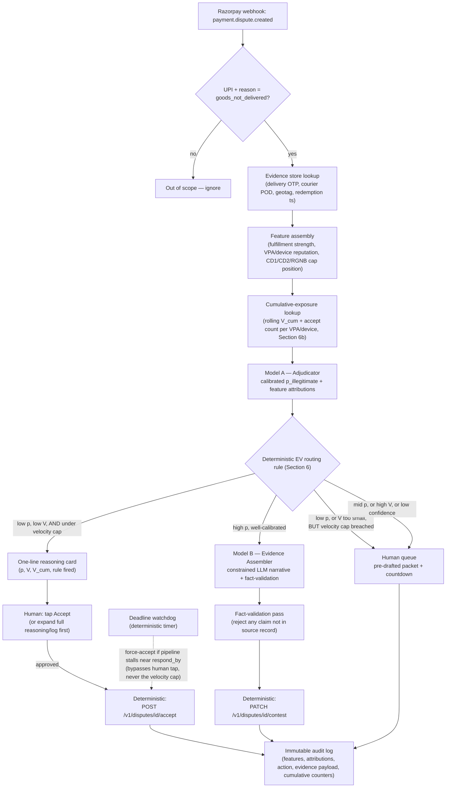

# ArgusML — UPI P2M Dispute-Defense & Risk Gateway
*(Commonly referred to as **Argus Pipeline** or **Argus Gateway**)*

**ArgusML** is an automated dispute-defense, risk analysis, and evidence-assembly pipeline designed specifically for the UPI P2M "goods/services not delivered" dispute cycle (Razorpay AI Buildathon, Track 02: AI Risk Manager). Operating as a specialized gateway and pipeline for payment platforms like Razorpay, ArgusML processes legitimate refunds and combats fraudulent claims and scams by analyzing transactional risk signals and assembling verifiable evidence, helping merchants protect revenue and avoid losing money to procedural defaults.

---

## 1. The Problem: The UPI SLA Race

When a customer raises a "Goods/Services Not Delivered" complaint on a UPI P2M transaction via NPCI's UDIR rails, the merchant has a strict deadline (`respond_by`, typically T+3 for P2M) before the complaint **silently auto-converts into a full chargeback loss by default**.

Traditional card-scheme chargeback defense tools fail here:
- **Card tools assume Visa/Mastercard representment** (5–7 day merchant response windows, Compelling Evidence rules).
- **UPI runs on automated NPCI UDIR/RGNB mechanics** where evidence must be marshaled and submitted rapidly before `respond_by` expires. Even a merchant who genuinely delivered will lose if no verified evidence is submitted in time.

ArgusML solves this procedural loss mechanism by deciding before `respond_by` whether to:
1. **Auto-accept** the loss (single-tap human checkpoint, bypassable by deadline watchdog under time pressure).
2. **Auto-contest** with verified fulfillment evidence (delivery OTP, courier POD, geotags, digital redemption).
3. **Escalate** to human reviewers (mid-confidence, high-value, or cumulative exposure breaches).

---

## 2. Pipeline Architecture



---

## 3. What's Built

| Component | Path | Status | Role & Guarantees |
|---|---|---|---|
| **Deterministic Decision Engine** | `src/decision_engine.py` | Built | Implements Section 6 EV economic formula and Section 6b velocity/cumulative-exposure gate; evaluated upstream before auto-accept. |
| **Model A Adjudicator** | `src/model_a_adjudicator/` | Built | Gradient-boosted trees with isotonic calibration predicting $p_{\text{illegitimate}}$ and directional feature attributions. |
| **Model B Evidence Assembler** | `src/model_b_evidence_assembler/` | Built | Constrained LLM narrative drafting with deterministic fact-validation (`validate_facts.py`) blocking unverified claims. |
| **Dispute State Machine** | `src/dispute_state_machine.py` | Built | Strict lifecycle state machine preventing contradictory transitions (409 Conflict), locking terminal states, and gating exceptional reopening. |
| **Persistent Human Review Stores** | `src/human_review/` | Built | SQLite-backed `AcceptCheckpointStore` and `EscalationQueue` (WAL mode, `busy_timeout=5000`) with dynamic callback rebinding across process restarts. |
| **Razorpay API Client** | `src/razorpay_client.py` | Built | Client for Razorpay Disputes API in official test mode (HTTP to `api.razorpay.com/v1`), with local sandbox mock fallback when credentials are unset. |
| **Webhook Listener & Dashboard** | `src/webhook_listener.py`, `src/ui/routes.py`, `src/app_state.py` | Built | FastAPI listener for Razorpay webhooks, signature verification, and operator dashboard at `http://localhost:8080/`. |
| **Drift Monitor (P2)** | `src/drift_monitor.py` | Built | Rolling window distribution drift monitor for Model A predictions. |
| **Immutable Audit Log** | `src/audit_log.py` | Built | Append-only SQLite audit trail recording recommendation vs execution, actors, razorpay dispatch flags, and feature attributions. |
| **Evaluation & Ablation Harness** | `eval/run_eval.py` | Built | Evaluates Model A baseline, noisy-evidence degradation, and feature-masked sensitivity on held-out split; regenerates `METRICS.md`. |
| **Hardening & Boundary Test Suites** | `src/adversarial_boundary_test.py`, `src/hardening_test.py` | Built | 29 focused tests covering lifecycle states, recommendation vs execution audit semantics, truthful confidence gating, and boundary limits. |
| **Extension Points (Section 13)** | *Documented only* | Not Built | Refund-destination mismatch, quick-commerce item swaps, and AutoPay mandate-revocation early warnings. |

### Security & Sandbox Defaults
By default, for local testing and demo ergonomics, `RAZORPAY_WEBHOOK_SECRET` and `DASHBOARD_USERNAME`/`DASHBOARD_PASSWORD` default to unset (fail-open mode: webhook signature validation and dashboard auth are bypassed). On startup, a warning is logged when running in this mode. In production deployments, set these environment variables to enforce HMAC-SHA256 signature verification and HTTP Basic Auth.

---

## 4. How to Run Locally

Run once to initialize synthetic data, train Model A, and verify metrics against the held-out split:

```bash
# 1. Run the Automated Test Suite (106 tests across unit, integration, adversarial boundary, and product hardening suites)
python -m pytest src/ data/ -v

# 2. Generate Deterministic Synthetic Dataset (6,000 records)
python data/synthetic_generator.py

# 3. Train Model A Adjudicator (GBDT + Isotonic Calibration)
python -m src.model_a_adjudicator.train

# 4. Evaluate on Held-Out Split & Regenerate METRICS.md (Baseline + Robustness Ablations)
python eval/run_eval.py
```

### Part 2: Live Demo Sequence
Run to seed demo evidence, launch the webhook listener, and trigger demo dispute flows:

```bash
# 1. Seed local SQLite evidence & exposure stores
python demo/seed_demo_evidence.py

# 2. Start webhook listener & operations dashboard in background
python src/webhook_listener.py &

# 3. Flow A: Accept recommendation (one-line card)
curl -s -X POST localhost:8080/webhook -H 'Content-Type: application/json' -d @demo/sample_accept.json

# 4. Flow B: High-confidence auto-contest (verified fulfillment evidence)
curl -s -X POST localhost:8080/webhook -H 'Content-Type: application/json' -d @demo/sample_contest.json

# 5. Flow C: Velocity breach escalation (Section 6b gate routing to human review)
curl -s -X POST localhost:8080/webhook -H 'Content-Type: application/json' -d @demo/sample_escalate.json

# 6. View operations dashboard
curl -s localhost:8080/
```

---

## 5. Evaluation Results (Section 7)

Evaluated on N=1,200 out-of-time holdout disputes generated by a seeded synthetic pipeline (see [METRICS.md](METRICS.md) for full breakdown):

### Baseline Operating Performance
- **Operating Precision (Auto-Contest Tier):** **94.4%**
- **Operating Recall (Auto-Contest Tier):** **97.3%**
- **False-Positive Cost:** **₹7,020.00** total across the 1,200-case holdout (≈₹5.85/case average from penalty and dispute processing costs on wrongful contests)
- **Routing Split:** 58.3% Contest / 37.8% Accept / 3.9% Escalate — Accept rate reflects 37.8% of cases falling below the EV contest threshold ($p \le 0.25$ and net contest advantage $\le 0$)
- **Calibration (Brier Score):** **0.0338**
- **RGNB / High-Risk Recall:** **84.3%**

### Robustness & Ablation Stress Test (Evidence Imperfection)
- **Noisy Evidence (20% Random Signal Drop/Corruption):** Precision **95.3%**, Recall **71.0%**, FP Cost **₹4,320.00** (graceful recall degradation with tightly bounded penalty costs).
- **Missing Evidence (Zero Fulfillment Proof):** Auto-Contest Rate **0.0%**, FP Cost **₹0.00** (**safe failure mode:** the deterministic EV gate immediately suppresses auto-contesting when proof is absent, avoiding penalty fees).
- **Feature Sensitivity:** Calibrated $p_{\text{illegitimate}}$ drops from **0.945** (baseline) down to **0.000** when fulfillment proof is masked, proving the model is genuinely grounded in physical delivery evidence rather than over-indexing on buyer reputation.

Full details, subgroup breakdowns, and roadmap plans are recorded in [METRICS.md](METRICS.md).

---

## 6. Known Limitations & Next Steps

- **Evaluation on Synthetic Data:** Evaluation is on synthetic data (N=1,200) from our own generator; real dispute data would be needed to validate these numbers before production use.
- **High-Risk Recall Gap:** High-risk recall (84.3%) trails overall recall (97.3%) — likely due to sparser feature coverage on RGNB cases; next step is targeted feature engineering here.
- **Soft Identity Signal:** Identity key (`vpa_hash + device_fingerprint_hash`) is a soft signal — a determined actor rotating either value resets exposure tracking. Production would need a harder-to-rotate behavioral signal.
- **Enterprise Network Hardening:** Edge routing, rate limiting, and mTLS proxying required for enterprise high-throughput deployment.

---

## 7. Differentiation (Section 11) & Scope Guardrails (Section 13)

- **Mechanical Correctness:** Anchored to real NPCI UDIR and RGNB override rules, not card chargeback assumptions.
- **Velocity Loophole Closed (Section 6b):** Rolling cumulative-exposure gate evaluates identity volume before the per-dispute EV accept rule, preventing micro-loss abuse.
- **Strictly Defense-Only (Section 12):** Contests only using pre-existing fulfillment records (OTP, POD, geotags). Never fabricates evidence.
- **Constrained Model B Evidence Assembler (Section 5, Section 12):** LLM drafting (`assemble.py`) strictly confined to narrative summary prose with structured evidence fields injected verbatim in code. The deterministic fact-validation layer (`validate_facts.py`) hard-blocks any draft containing unverified document IDs, unmatched timestamps, fabricated couriers, false OTP claims, unverified digital voucher redemptions, or fulfillment type contradictions, with zero-risk degradation to the deterministic contest payload on failure or absent credentials.
- **Documented Extension Points (Section 13):** Designed to support refund-destination mismatch verification, quick-commerce item-swap scoring, and AutoPay mandate-revocation early warnings as external modules without altering the core decision boundary.
